# NP Career Hub
The digital economy has fundamentally changed how individuals approach career development. With rapid growth in specialized sectors like IT, Healthcare, and Finance, there is an urgent need for centralized platforms that connect talent with the right opportunities. __NP Career Hub__ is a full-stack solution designed to streamline this process, offering a modern interface for job discovery and a secure environment for professional profile management.

- This app is design for both desktop and mobile view.
- If you unable to fetch data, you can try changing your network to mobile hotspot.
- `My project link` https://np-sep-career.vercel.app/

## Problem Statement
1. __The Challenge__:
   - Current job search processes are often fragmented, making it difficult for users to filter relevant roles in high-demand industries. Additionally, many platforms lack robust security measures for personal data, such as profile images, which can lead to privacy risks if not handled through secure, server-side processes.

2. __Proposed Solution__
 NP CareerHub addresses these issues by:
    - __Industry-Specific Categorization__: Grouping opportunities into clear sectors (e.g., IT & Tech, Finance, Engineering) to reduce information overload.
    - __Secure Identity Management__: Implementing a signed upload system via [Cloudinary](https://cloudinary.com/), ensuring that user profile images are managed through verified backend requests rather than public frontend access.

## Technologies Used
1. Frontend :
    - [React](https://react.dev/) : building fast, interactive, and reusable user interfaces easy and scalable.
    - [React-Router](https://reactrouter.com/) : keep UI in sync with the browser URL, allowing users to navigate between different views in a single-page.
    - [React Toastify](https://fkhadra.github.io/react-toastify/introduction/) : add customizable, non-blocking floating notifications (toasts) to your application to provide instant feedback to users.
    - [Lucide React](https://lucide.dev/guide/packages/lucide-react) : provides a collection of clean, consistent, and customizable SVG icons as ready-to-use React components.
    - [Tailwind](https://tailwindcss.com/) : style fast, consistently, and directly in JSX without writing custom CSS.
2. Backend :
    - [Express](https://expressjs.com/) : building fast, simple, and flexible backend APIs in Node.js easy.
    - [Joi](https://joi.dev/) : ensure incoming data from API requests matches a specific format, type, and constraint before the code processes it.
    - [Sequelize](https://sequelize.org/docs/v6/getting-started/) : Object-Relational Mapper (ORM) for Node.js that allows to interact with databases using JavaScript objects and methods instead of writing raw SQL queries.
3. Image storage :
   - [Cloudinary](https://cloudinary.com/) : media hosting for profile images.
4. Database : 
   - [Neon](https://neon.com/) : It provides a serverless, scalable PostgreSQL database that’s easy to deploy and manage.
5. Deployment:
    - Frontend: [vercel](https://vercel.com/shaus-projects)
    - Backend: [render](https://render.com/)

## Guides
1. __Home Page & Job Post detail page__
   - In the Top navigation bar, you can toggle to (company, notification, and profile). You can also input the job title you are interested in the search bar. It will bring you to a job search page. Click the CareerHub to go back to homepage.

        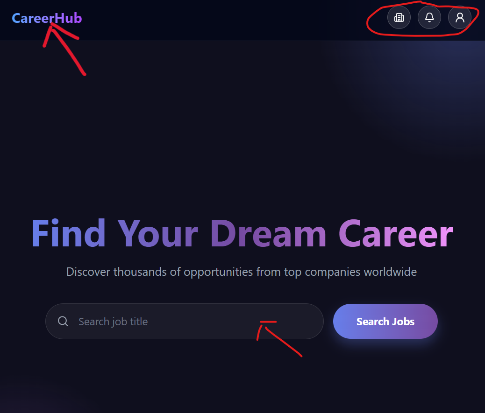

    - Keep scrolling down you will reach the industry button. You can browse the job by clicking each button.

        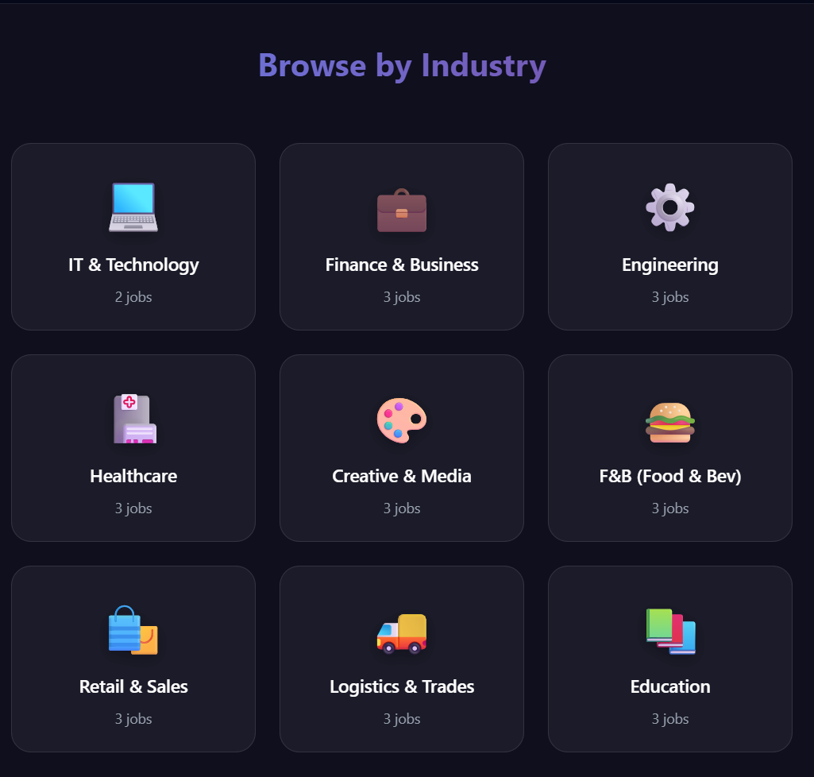
    
    - In the Home page, keep scrolling down you will see the job post card. You can click the visit button to view the detail of the job post. It will open a new tab to display the detail of the job post.

        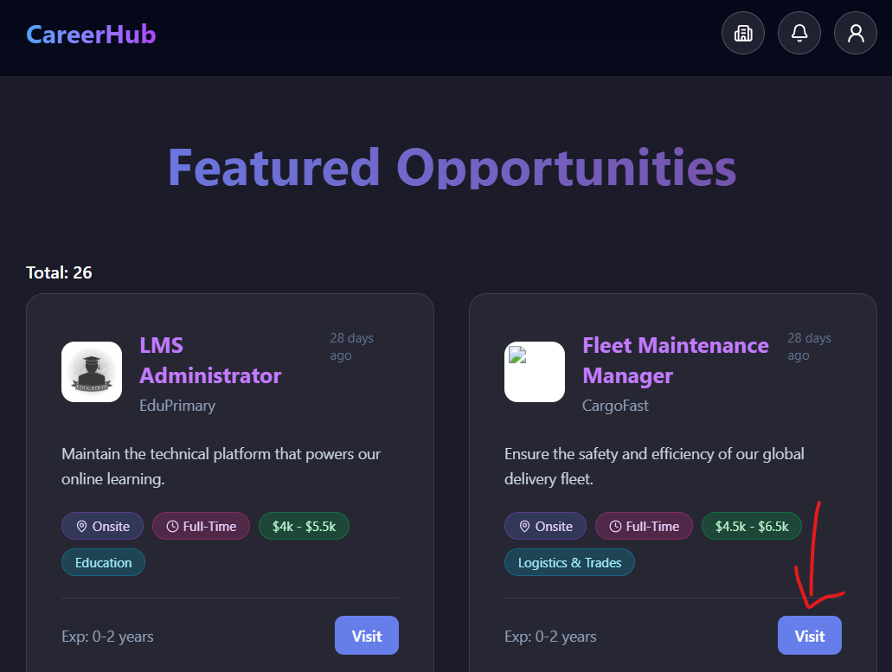

    - For Job post detail page, you can click the pink apply job button to apply job. If you have not logged in , the auth modal will pop up for you to login, else the application modal will be displayed.

        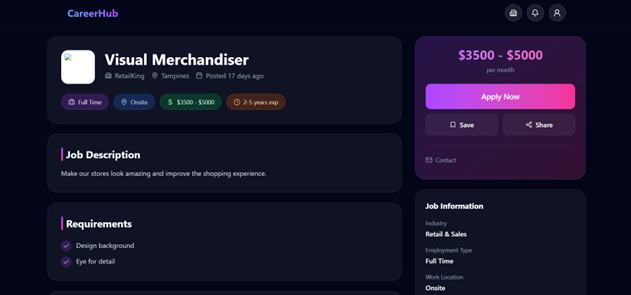

    - Input your expected salary and click submit application from the Application modal.

        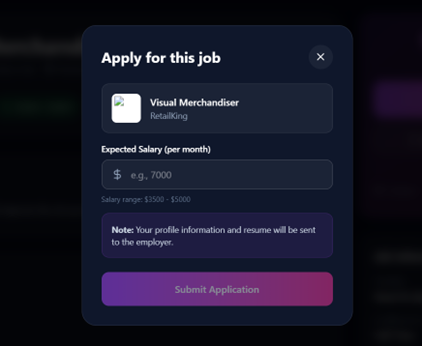
    
2. __Job Search Page__
    - You can search the job title from the top search bar and click search to fetch the data.
    - There is a different layout between bigger and smaller screen.
    - View 1: large screen
        * i.	The right-side bar is for you to filter the job post, you can click the dropdown button to sort the data by (Most recent, salary high-low, salary low-high).

            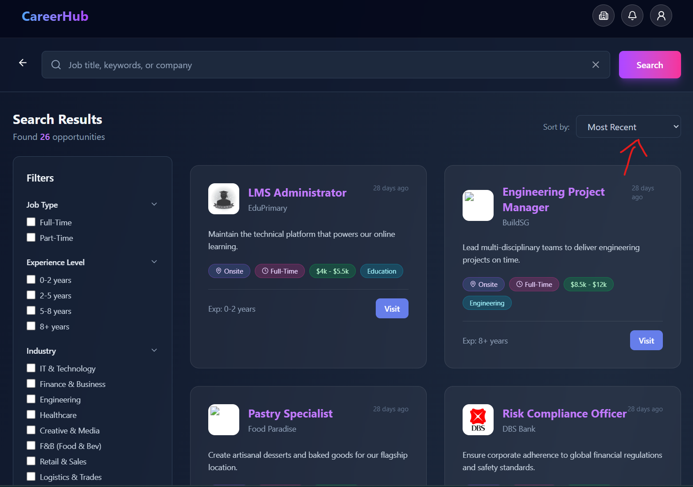

    -  View 2: smaller screen 
        * There is no sort by function in smaller screen size, but you can click the filters button to filter the job post.
             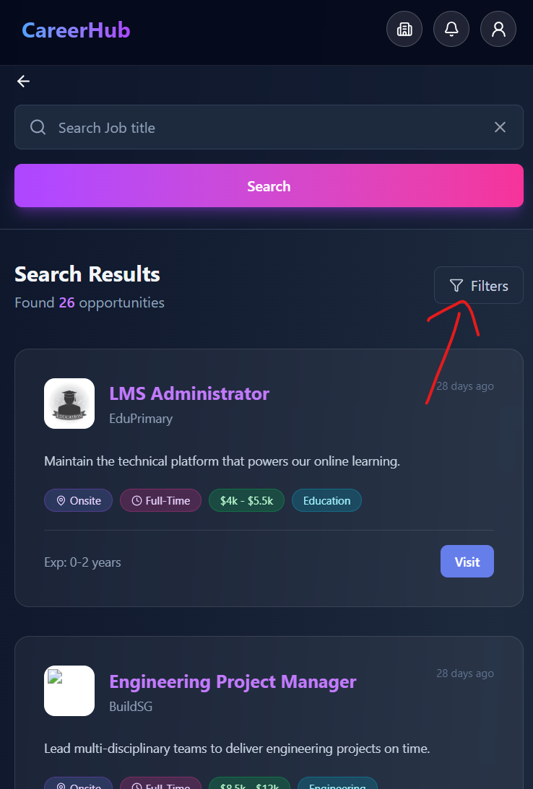
             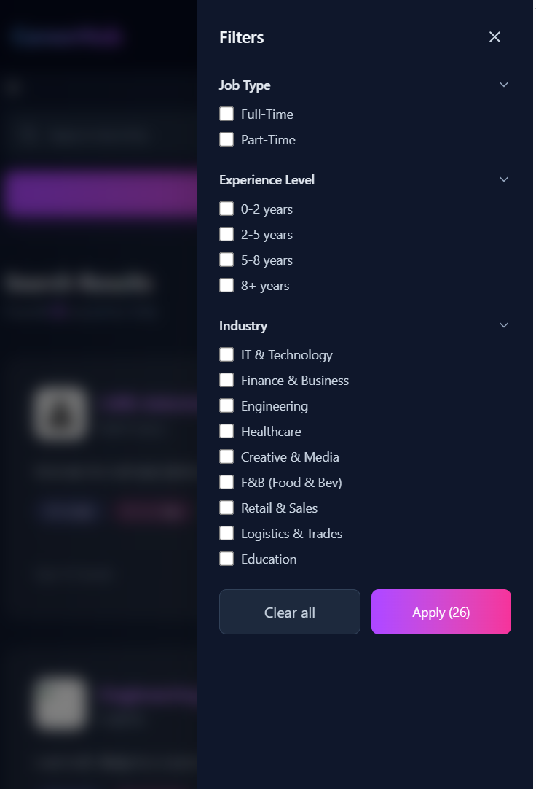
            
            
    - If there is error when fetching job. Click try again to continue.
         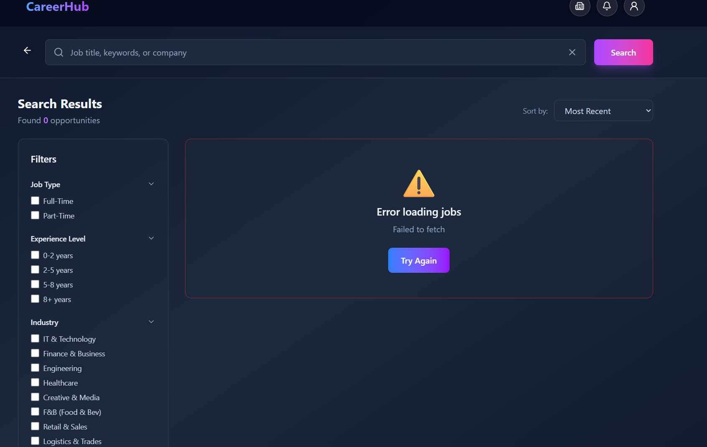
        
3. __Success /Error Message__
        - All success and error message for creating/updating/deleting will be  appear at the top right corner of the screen.
         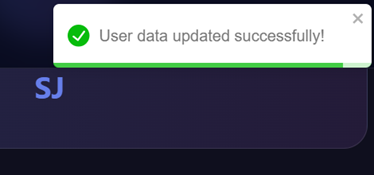
        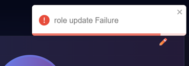

4. __Login / Sign Up__
    - If you have not logged in after clicking either tab (in the top right corner of the nav bar), the auth modal box will be popped up. You may toggle to login (left) or sign up(right). You can close the auth modal by clicking the cross button at the top right.
        

        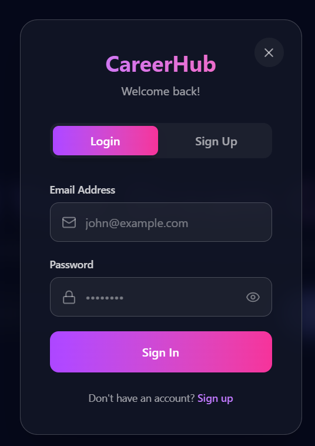
        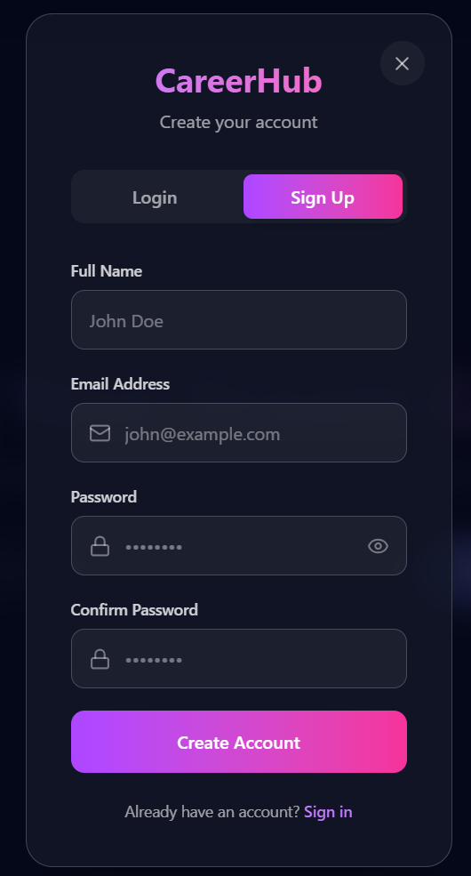
        

    - Error message will appear below of each input tag if input is invalid.
        

        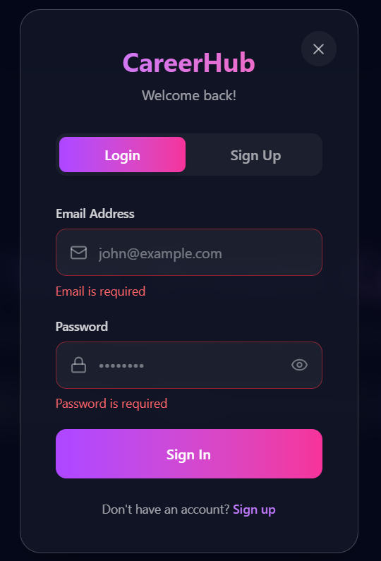
        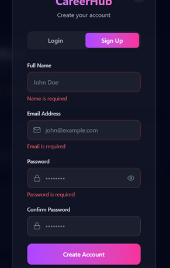
        

5. __User Profile__
    - __Click the top right profile icon, to visit your profile or logout__
        * If you have not logged in the login in modal will be popped out, else you will see the dropdown menu to navigate to view profile or logout.
         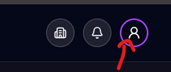
          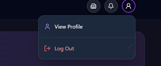
          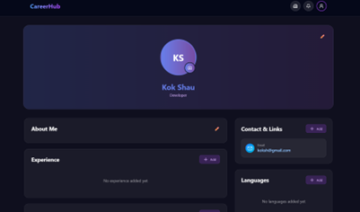
        * If you choose to logout, a confirmation will pop up, just click the red logout button. Result message will come out from the top right corner. Then browser will redirect you to home page.
         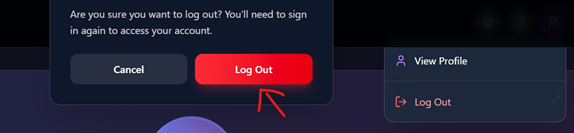
          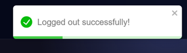

    - __Profile Image__
        * Click the camera button to upload image.
         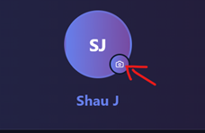

        * A box will pop up for you to upload image.
         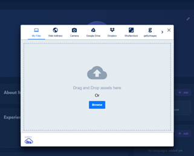

        * After uploading click done
         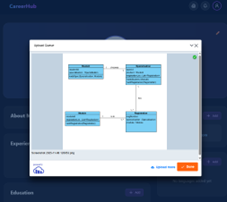

        * Your new image will be displayed.
         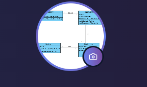

    - __Name & Role__
        * click pen icon to edit name and role, click the pen icon again to close.
        * click save to save data
        * You are not allowed to add empty data
         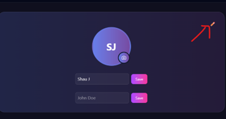
    
    - __Self Summary__
        * click the pen icon to update self-summary. 
         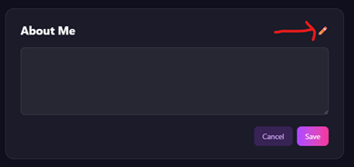
        * save button after done inputting.
        * Message will pop up at the top right corner to indicate success of failed.
         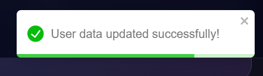

    - __Experience__
        * click add button to add experience. 
            - You can click the present button to mark as present.
            - Click pink add experience button below  to add data to database.
             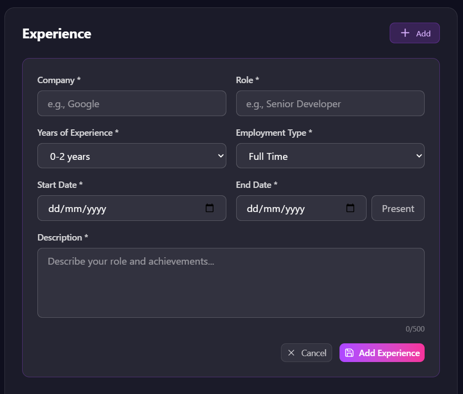
             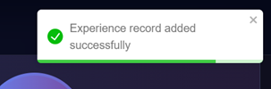

        * Click 3 dots to edit or delete experience.
             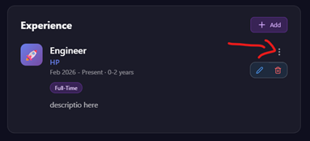
        * Click “Update Experience” to submit update.
             
        * If you choose to delete the experience record browser will pop up a confirmation modal . Click ok to proceed.
             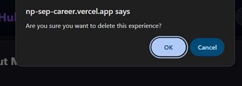
            * Record will be deleted and result message will pop up at the top right corner.
             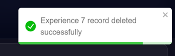

    - __Education__
        * The steps for Add/Edit/Delete education record is the same as experience. 
        * Click add button to add.
             
        * Click Add education to submit adding. You can click the present button if currently still pursuing the education.
        * Result message will pop up at the top right corner.
    
    - __Skills__
        * Click the pen icon. 
        * Input skill name
        * Click Add button to save your data.
        * Click the pen icon again to close the input bar. 
             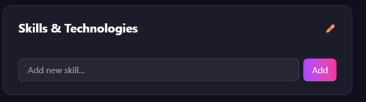
        * In the edit mode you can hover or click to delete the skill record. Note: If you are using mobile, you can simple click the skill you want to delete it in the edit mode. 
             
        * Click the pen icon again to close the input box.
             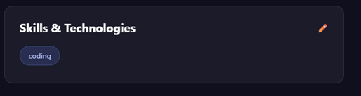

    - __Links__
        * Your Email will be displayed here and is not allowed to change.
        * Click the purple Add button to add new link.
             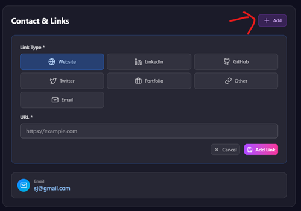
        * click the available Link Types for your URL
        * Input your URL and click the pink Add link button to add new URL or click grey Cancel button to close.
        * To edit or delete the URL, click the 3 dots .
             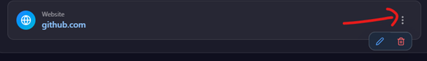
        * For updating URL. After done editing click Update link to update changes, or click cancel to close the edit box.
             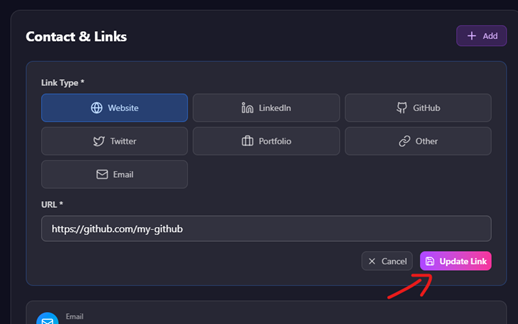
    
    - __Language__
        * Click Add button to add language
             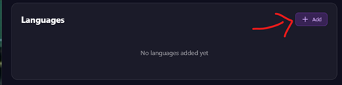
        * Click purple Add Language to add data or click grey Cancel button to close the box.
             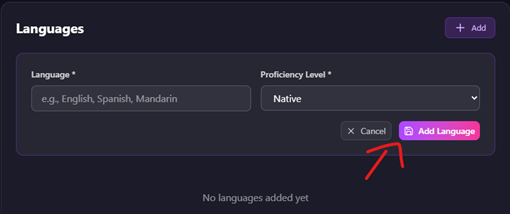
        * Click the 3 dot to delete data
             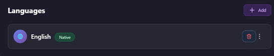

    - __Application stats__
        * You can only see your application stats.
        * The First data (Green User icon) is the total job you have applied.
        * The second data (yellow clock icon) is the total number of jobs that you have applied that status is pending.
        * The third data (purple calendar icon) is the total number of jobs that you have applied that status is interview.
             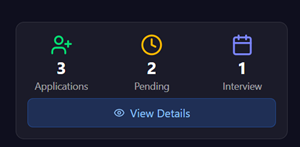
        
        * You can click view details to view the detail. A modal will pop up to show your job application history. 
        * The pink visit button is for you to visit the Job post page.
             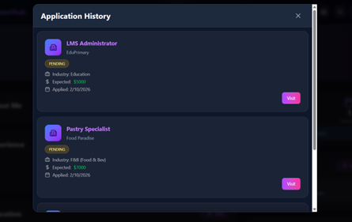

6. __Company__
    - After you click the building icon in the top right of the navigation. You will be redirected to a page where you can see the company you are added or you can search by company name.
         

        * View 1: You have been added to a company. (You can be added to more than 1 company). 
            1. If you click the company, you will be redirected to the company detail page.
            2. Your company role will de displayed at the top right corner of the company box.
             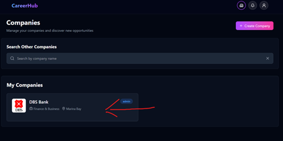

        * View 2: You have not been added to any company.
             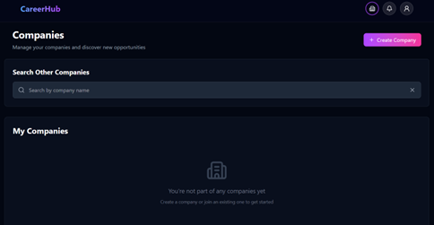

    - You can search the company in the Search Other Companies input bar.
        * View1: company name match. You can click the grey right arrow button to view the company detail page
         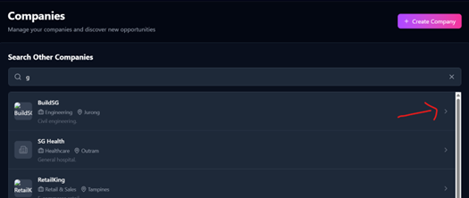
        * View 2: if company name not found.
         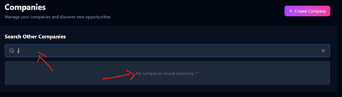

    - You can click the pink Create Company button to create your own company.

         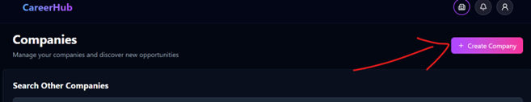

        * After clicking the create company button a form modal will pop out.
            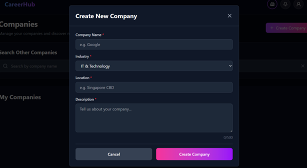

        * If successfully created the top right corner should show success message.
             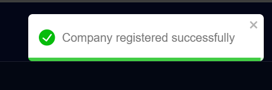
            
        * If submit an existing company name top right corner should pop up an error message.
             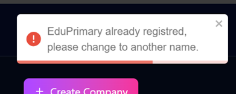

7. __Company Detail__
    - Company profile data (Profile image, Company name, location, industry, About Us):
        * Can only be modified by admin or owner
    - Post New Jobs:
        * All company members.
    - Change job applicant status:
        * All company members.
    - Add new company member:
        * Only admin or owner can add member
    - Change member data:
        * Owner and admin can change anyone to member or admin, but nobody can change the owner to member or admin.
    - This is a single company detail page. The camera button and the pen icon will only show up if you logged in and is a admin or owner of the company.
    - You can scroll down to see the Job post list of the company. If you logged in and is also a member of that company, you will be able to see the job Applicant and company member.
    - View 1 if you already logged in and is a member of that company.
         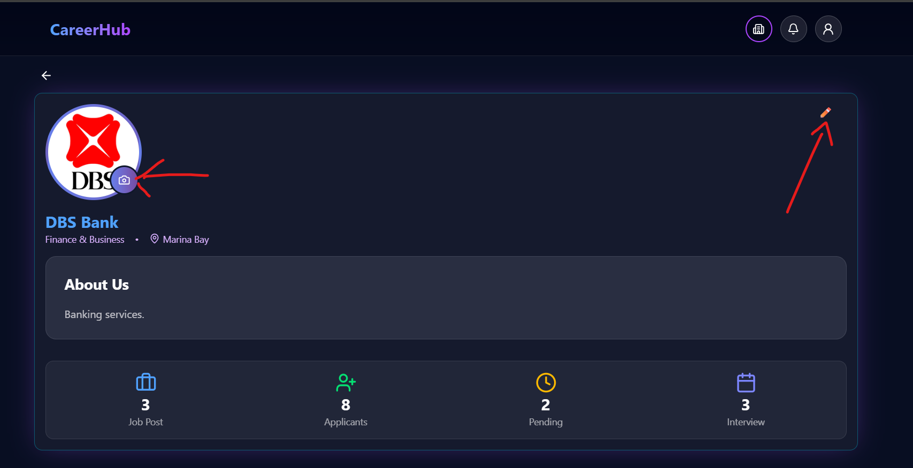
         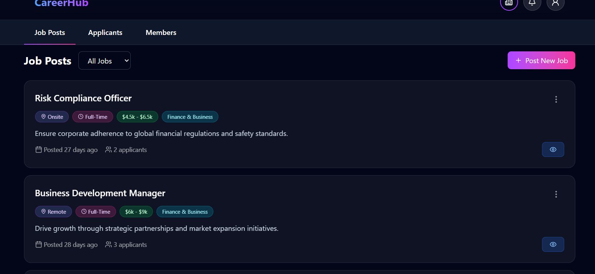

    - View 2 if you are not a member of that company, regardless of logged in /out. (No Job Applicant & Member list are displayed)
         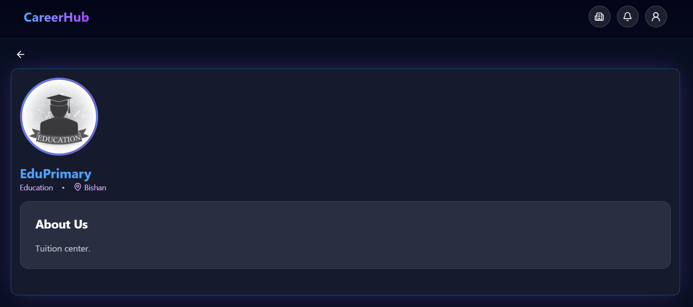
         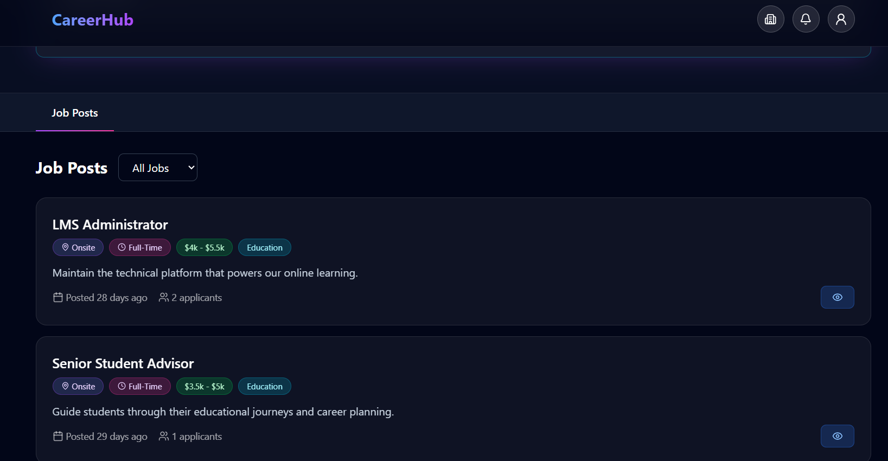

    - To modify company data,
        * after you click the edit icon at the top right. If you change company name to an existing name, you will also get error message at the top right.
        * You can click the camera button at the profile image to change company profile image.
        * Click save to save your latest data or cancel to close the edit mode.
             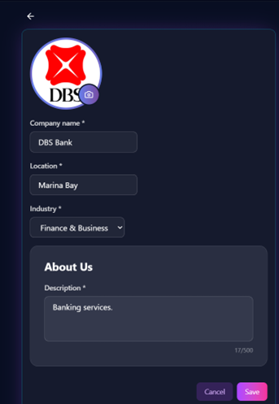

    - Company job post
        * You can filter the data from the dropdown list.
        * Click pink __Post New Job__ to post new job post.
             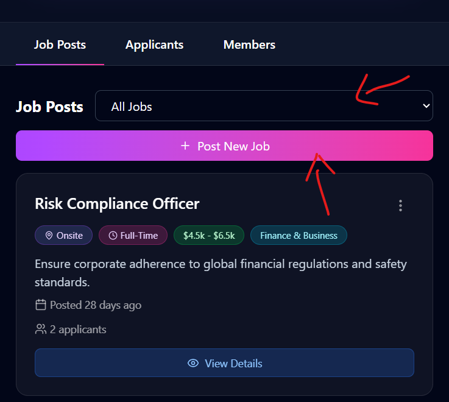
        * After clicking Post New Job, a modal will pop up for you to input your job detail. For Requirements/Responsibilities/Benefits, you can click the blue Add button to add your data. Once done click create Job Post button or click Cancel to close the modal.
             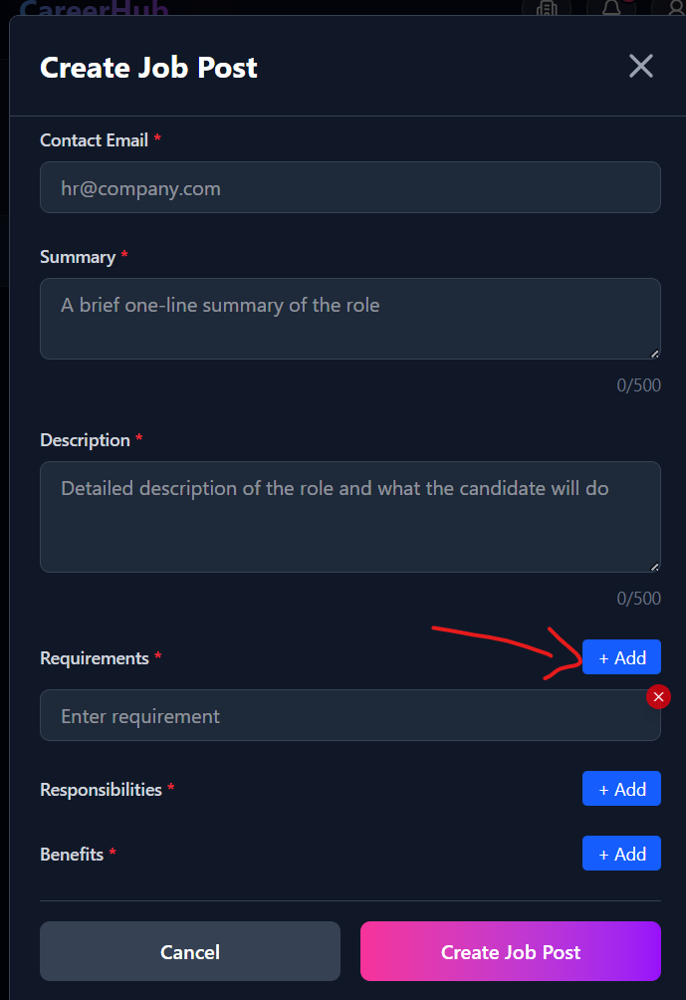
        * To edit job post just click the 3 dots, the blue pen icon and red trash icon will be shown, you can click the pen for edit and trash for setting the job post as remove.
             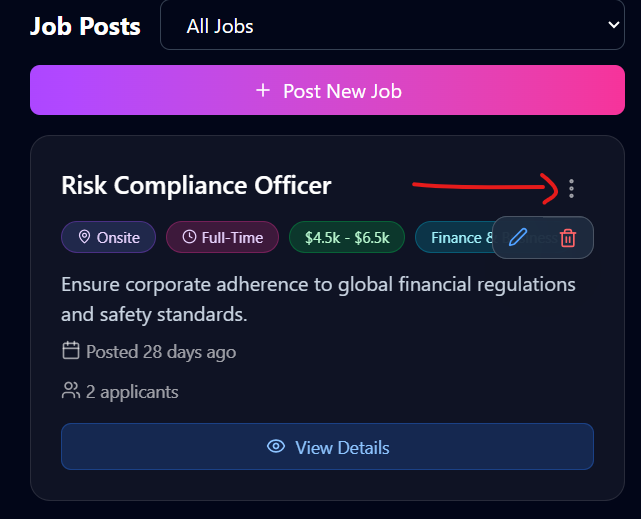
        * Edit job post
             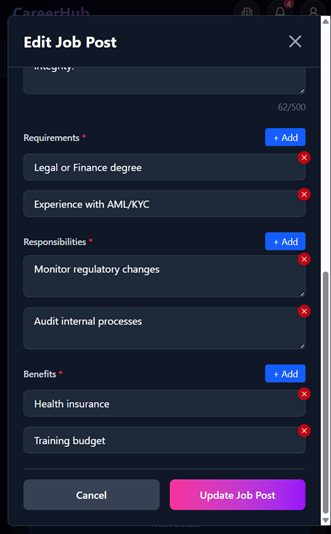
            
        * To remove job post, a confirmation will pop up.
             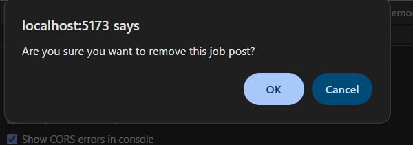
              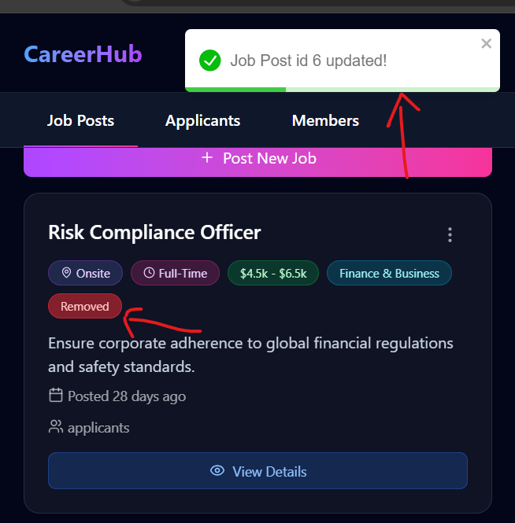
            
    - Applicants
        * Click blue View Details to View Applicants detail (will go to the applicant profile).
        * Click 3 dots to response to the applicants.
        * You can filter the job from the All-Jobs dropdown list (left).
        * You can also filter the applicant status from the All-Status dropdown list (right).
             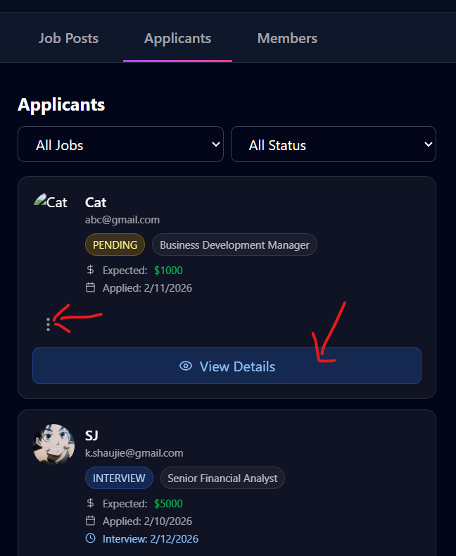
        * After you click the 3 dots, more button will appear.
             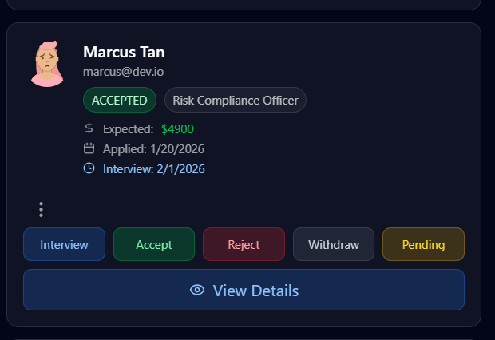
        * If you click Accept/Reject/Withdraw/Pending, confirmation will pop up
             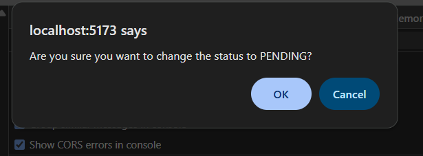
        * If you click Interview, a modal will pop up for you to input interview data
             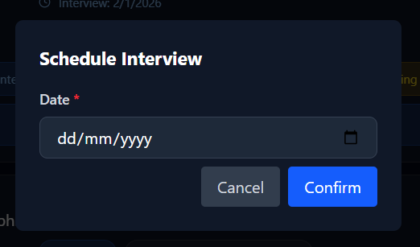

    - Member
        * If you are a member only, you would not see the pink Invite Member button and the 3 dots (at each member box)
             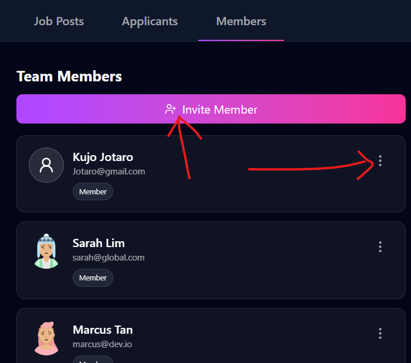

        * If you click Invite Member button to add member in, search user id modal will pop up for you to search the by user id.
             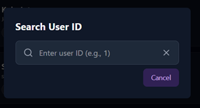

            - View 1: If user is already a member
                 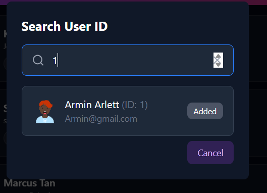

            - View 2: If user is not a member. You can click the Add button to add the user in.
                
                 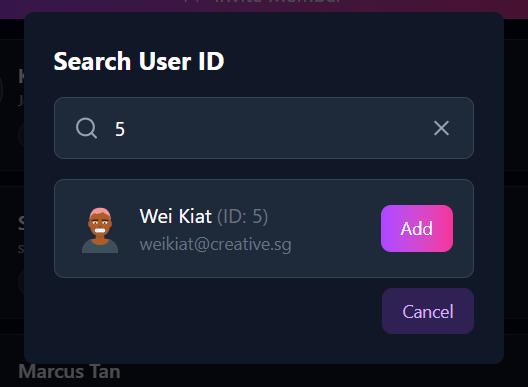
                 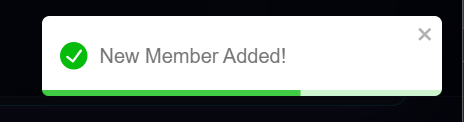
                
            - View 3 : If the member has been removed.
                 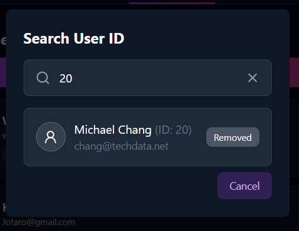

               
        * When you click the 3 dots , blue pen icon will be shown for admin/owner to edit the member’s data. If you click the pen button, a modal will pop up for you to change it.
             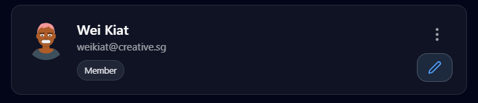
             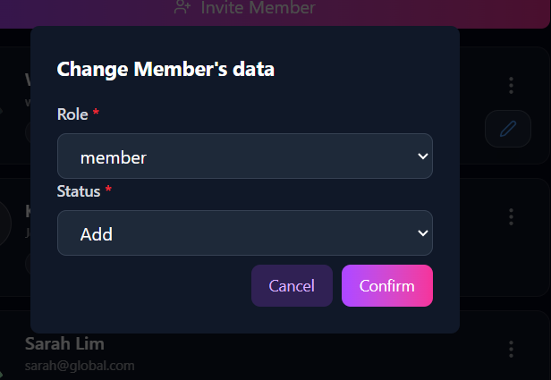

        * You can change the role by clicking the dropdown list (member, admin, owner).
        * You can remove or re-add the member from the Status dropdown list (Add, Removed).
        * Once done, click confirm to commit changes or cancel to close modal.

8. __Notifications__
- The navigation bar will show the total number your unread notification.
     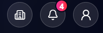
    * You can click the blue Mark all read button or just click the Mark as read word to mark your notification as read.
    * Each unread notification will have blue border, blue circle at top left, and a Mark as read word below (Number 1 & 2), while read notification does not.
    * Once you mark your notification as read, the total number of unread message at the navigation will be reduced, if no unread message, the red number will not be shown. 
         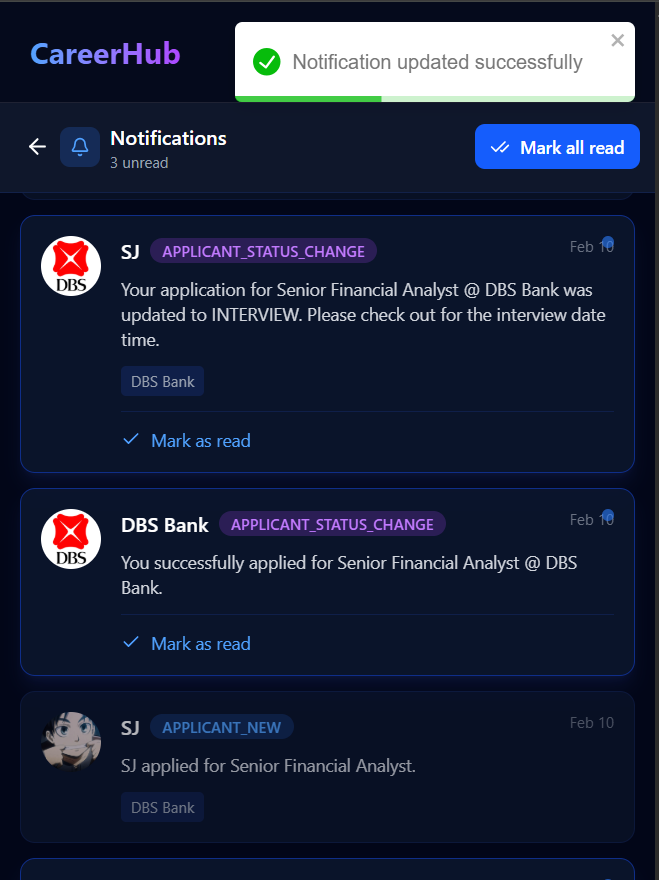

## Credits
- No Third party API, audio is used in this project.
- The favicon image taken from [here](https://www.freepik.com/premium-vector/career-icon-template_52217333.htm)
     